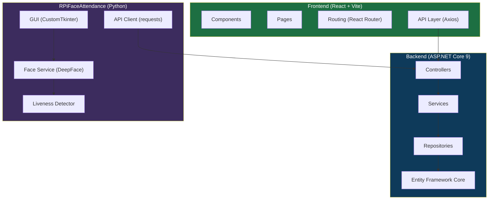

# 🚀 Power Campus Suite

> A modern, **premium** learning management ecosystem comprising a **.NET 9.0 Web API**, a **React/Vite Frontend**, and a **Raspberry Pi Face‑Recognition Attendance** system.

---

## 📚 Overview

- **Backend** – .NET 9.0 Web API (Entity Framework Core, JWT auth, Swagger). Handles users, courses, enrollments, schedules, grades, and attendance.
- **Frontend** – React 18 + Vite SPA with dark‑mode, glass‑morphism UI, and responsive layout.
- **RPiFaceAttendance** – Python 3.x app (CustomTkinter) leveraging YOLOv8, DeepFace (ArcFace), and an adaptive liveness detector.

---

## 🖥️ Architecture Diagram



---

## 🔧 Getting Started

### Backend
1. **Prerequisites**: .NET 9 SDK, SQL Server.
2. Open `webBackendGP` in VS Code or Visual Studio.
3. Update the connection string in `appsettings.json`.
4. Run migrations:
   ```bash
   dotnet ef database update
   ```
5. Launch the API:
   ```bash
   dotnet run
   ```
   Swagger UI will be available at `https://localhost:7065/swagger`.

### Frontend
1. Install Node 18+.
2. ```bash
   cd frontend
   npm install
   npm run dev
   ```
   The app will be served at `http://localhost:5173`.

### RPiFaceAttendance
1. Ensure Python 3.10+ is installed.
2. ```bash
   cd RPiFaceAttendance
   python -m venv .venv
   .venv\Scripts\activate   # Windows
   pip install -r requirements.txt
   python src/main.py
   ```
   The first run will download the ArcFace model (~250 MB) automatically.

---

## 📦 Deployment
- **Backend** – Deploy to Azure App Service, AWS Elastic Beanstalk, or any Linux container. Use Dockerfile (included in repo) for reproducible builds.
- **Frontend** – Build with `npm run build` and serve static files via Nginx, Azure Static Web Apps, or Netlify.
- **RPiFaceAttendance** – Deploy on a Raspberry Pi with camera module; run as a systemd service for reliability.

---

## 🤝 Contributing
Contributions are welcome! Please fork the repository, create a feature branch, and open a pull request. Follow the existing code style and run the tests before submitting.

---

## 📄 License

MIT License – see `LICENSE` for details.
