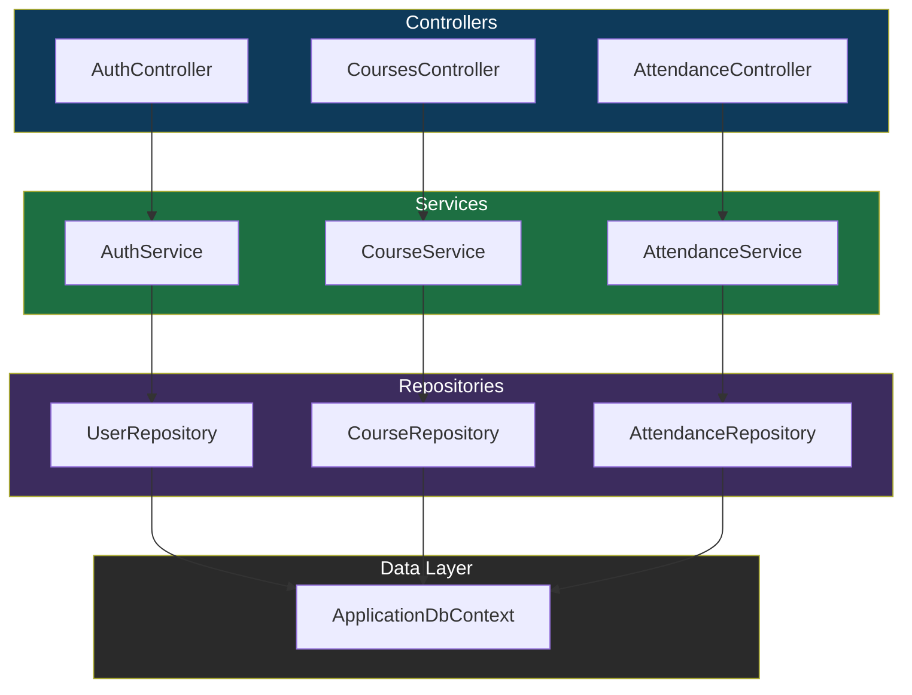

# Power Campus Backend Documentation

> A **premium**, modern RESTful Web API built with **ASP.NET 9.0** that drives the Power Campus ecosystem.

---

## 📐 Architecture



---

## 🛠️ Tech Stack
- **Framework**: ASP.NET Core Web API ( .NET 9.0 )
- **ORM**: Entity Framework Core 9.0
- **Database**: SQL Server (LocalDB or remote)
- **Auth**: JWT with role‑based access control (Admin / Instructor / Student)
- **Docs**: Swagger / OpenAPI UI

---

## 🔐 Security & Authentication
- `POST /api/auth/login` returns JWT token.
- Include `Authorization: Bearer <token>` on protected routes.
- RBAC enforced via `Authorize` attributes on controllers.

---

## 📁 Project Structure (high‑level)
```
webBackendGP/
├─ Controllers/      # API endpoints
├─ Services/         # Business logic
├─ Repositories/    # Data access
├─ Data/             # DbContext & migrations
├─ Models/           # EF entities
├─ DTOs/             # Transfer objects
├─ appsettings.json  # Config (connection strings, JWT key)
└─ Program.cs        # Host building & DI registration
```

---

## 🚀 Getting Started
### Prerequisites
- .NET 9 SDK
- SQL Server (or LocalDB)

### Configuration
Edit `appsettings.json` → set `ConnectionStrings.DefaultConnection` and JWT `Key`.

### Run the API
```bash
# restore packages & build
dotnet restore
# apply migrations
dotnet ef database update
# start
dotnet run
```
Open Swagger at `https://localhost:<port>/swagger`.

---

## 🧪 Testing
- Unit tests live in `Tests/` (if present).
- Run with `dotnet test`.

---

## 📦 Deployment
- Dockerfile included for containerised deployment.
- Azure App Service / AWS Elastic Beanstalk are supported.

---

## 🤝 Contributing
Fork → feature branch → PR. Follow the existing coding style and run `dotnet format` before committing.

---

## 📄 License
MIT – see `LICENSE`.
