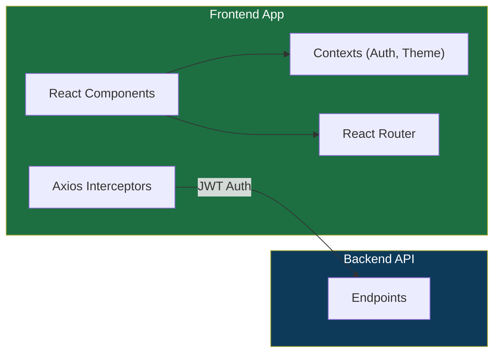

# 🎨 Power Campus Frontend Documentation

> A modern, **premium** Single Page Application (SPA) built with **React and Vite**. It serves as the responsive, interactive portal for Students, Instructors, and Administrators.

---

## 🏗️ Architecture & Tech Stack



- **Framework**: React 18
- **Build Tool**: Vite (for lightning-fast HMR and optimized production builds)
- **Routing**: React Router DOM v6
- **HTTP Client**: Axios (configured with interceptors for JWT token attachment)
- **Icons**: Lucide React
- **Styling**: Vanilla CSS with full Dark Mode support and responsive, glassmorphism design principles.

---

## 📁 Directory Structure

The main source code is located in `frontend/src`:

| Folder | Purpose |
|---|---|
| `/api` | Centralized Axios configuration and API service functions. |
| `/assets` | Static assets like images (e.g., `logo-english.png`). |
| `/components` | Reusable UI components (Sidebar, Navbar, Modals, Buttons). |
| `/contexts` | React Context providers for global state (e.g., `AuthContext`, `ThemeContext`). |
| `/pages` | Top-level page components representing different application routes. |

---

## 🎭 Key Features by Role

The UI dynamically adapts based on the logged-in user's role (Admin, Instructor, Student), authenticated via JWT claims.

### 🛡️ Admin
- **User Management**: View, add, edit, and delete users across the system.
- **System Overview**: Full access to all scheduling and course creation tools.

### 👨‍🏫 Instructor
- **My Courses**: View assigned courses.
- **Grades Management**: Select a course, view enrolled students, and input/update grades.
- **Schedule**: View personal teaching schedule.

### 🎓 Student
- **Course Catalog**: Browse available courses and enroll.
- **My Courses**: View enrolled courses with an option to drop them.
- **My Schedule**: View a personalized weekly timetable.
- **My Grades**: View grades for completed courses.
- **My Attendance**: Track attendance records logged by the biometric system.

---

## 💅 UI / UX Design

- **Responsive Layout**: Sidebar + Main Content layout. The sidebar collapses elegantly on mobile devices.
- **Dark Mode**: Integrated via a toggle switch. Powered by CSS Variables (`--bg-primary`, `--text-primary`) for seamless palette switching.
- **Premium Aesthetics**: Micro-interactions on hover, smooth page transitions, and modern glassmorphism UI elements to provide a wow-worthy user experience.

---

## 🔐 State Management & Authentication

- **AuthContext**: Manages the user's login state. Upon login, the JWT token is stored in `localStorage`. The context parses the token to extract user details (ID, Name, Role) globally.
- **Protected Routes**: React Router wrapper components ensure users are authenticated and authorized for specific roles before rendering. Unauthenticated users are redirected to `/login`.

---

## 🚀 Setup & Execution

### Prerequisites
- **Node.js** (v18+)
- **npm** or **yarn**

### Installation
1. Navigate to the `frontend` directory:
   ```bash
   cd frontend
   ```
2. Install dependencies:
   ```bash
   npm install
   ```

### Configuration
Update the backend API URL if needed. This is typically configured in `.env` or inside `src/api/axiosConfig.js` (pointing to `https://localhost:7065/api` by default).

### Running the App
Start the Vite development server:
```bash
npm run dev
```
The application will be available at `http://localhost:5173`.
